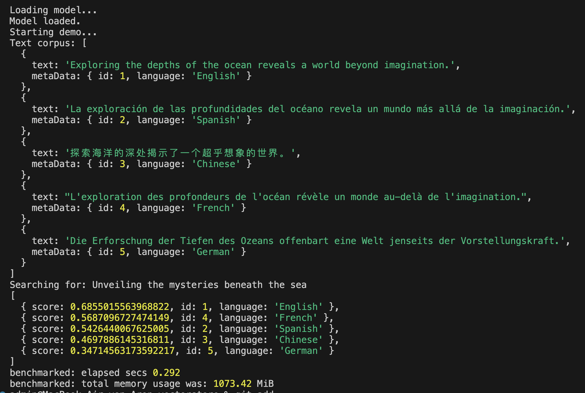

<h1 align="center">vectorstore</h1>

> Pure JavaScript implementation of a vector store with similarity search. Runs locally, in Node/Bun/Deno and soon even in your browser. Supports various embedding models, default to `nomic-embed-text-v1`. Open-source, fast and cost-free.

<h2 align="center">Features</h2>

- ✅ Search for text similarities, locally, without API key, free of charge
- ✅ Best in class performance; better than OpenAI (see "The Science" section)
- ✅ Downloads the model automatically, caches it, executes offline afterwards
- ✅ Runs Node.js and (soon) in the browser (large download though ~500 MB)
- ✅ Uses the open-source `nomic-embed-text-v1` text embedding model, 8192 token context window
- ✅ Benchmarked: ~1 GiB memory usage at runtime
- ✅ Fast! Inference < 0.05 sec. on average (per document)
- ✅ Available as a simple API 
- ✅ Tree-shakable and side-effect free
- ✅ Runs on Windows, Mac, Linux, CI tested
- ✅ First class TypeScript support
- ✅ Well tested (soon to be... ;-)

<h2 align="center">Roadmap</h2>

- HNSW (Hierarchical Navigable Small World graphs) based vector search with complexity scaling O(log(N))
  - in best case, based on WebAssembly, using SMID vector instruction set
- alternativem WebGPU backend to run expensive vector operations (making use of [wasm_webgpu](https://github.com/juj/wasm_webgpu)

<h2 align="center">Initial results</h2>



<h2 align="center">Demo/Setup</h2>

```bash
npm install
npm run demo
```

<h2 align="center">The Science</h2>

If you came here to understand the math behind the scenes,
please head on to: https://towardsdatascience.com/text-embeddings-comprehensive-guide-afd97fce8fb5
where Mariya Mansurova wrote an excellent article on Text Embeddings.

Now let's dive deeper into metrics and open-source models:
https://towardsdatascience.com/openai-vs-open-source-multilingual-embedding-models-e5ccb7c90f05

This is why I decided to use `nomic-embed-text-v1`. (Nomic-Embed): The model was designed by Nomic, and claims better performances than OpenAI Ada-002 and text-embedding-3-small while being only 0.55GB in size. Interestingly, the model is the first to be fully reproducible and auditable (open data and open-source training code).

https://huggingface.co/nomic-ai/nomic-embed-text-v1

<h2 align="center">Example usage (API, as a library)</h2>

<h3 align="center">Setup</h3>

- yarn: `yarn add vectorstore`
- npm: `npm install vectorstore`

<h3 align="center">ESM</h3>

```ts
import { createDocument, search, type Document } from "vectorstore";
// This text corpus is a collection of documents in different languages, each describing the ocean.
// They share the meaning, but the words and even the symbols used to describe it are different.
// However, using vector embeddings, we can compare the documents and find similarities,
// which allows for cross-lingual search - a search that is made for humans, not machines.
// This quality is, for an open-source model, a major breakthrough.
// Combined with vector embedding search, everyone has access to local, powerful text search now.
// And the best news: It's fast, it's available, it's possible, now, and for free!
const myDocuments = [
  {
    text: "Exploring the depths of the ocean reveals a world beyond imagination.",
    metaData: { id: 1, language: "English" },
  },
  {
    text: "La exploración de las profundidades del océano revela un mundo más allá de la imaginación.",
    metaData: { id: 2, language: "Spanish" },
  },
  {
    text: "探索海洋的深处揭示了一个超乎想象的世界。",
    metaData: { id: 3, language: "Chinese" },
  },
  {
    text: "L'exploration des profondeurs de l'océan révèle un monde au-delà de l'imagination.",
    metaData: { id: 4, language: "French" },
  },
  {
    text: "Die Erforschung der Tiefen des Ozeans offenbart eine Welt jenseits der Vorstellungskraft.",
    metaData: { id: 5, language: "German" },
  },
];

console.log("Text corpus:", myDocuments);

const haystack: Array<Document> = [];

// vectorization (text to embeddings)
for (const doc of myDocuments) {
  haystack.push(await createDocument(doc.text, doc.metaData));
}

// vecotrization of the search string (which doesn't share much text similarity, BUT MEANING)
const needle = await createDocument(
  "Unveiling the mysteries beneath the sea",
);

console.log("Searching for:", "Unveiling the mysteries beneath the sea");

// running cosine similarity search in vector space
const searchResults = search(haystack, needle);

// displaying search results
console.log(
  searchResults.map((result) => ({
    score: result.score,
    id: result.doc.metadata.id,
    language: result.doc.metadata.language, // include language in the result for better context
  })),
);

/** Prints something like this:
 * Searching for: Unveiling the mysteries beneath the sea
  [
    { score: 0.6855015563968822, id: 1, language: 'English' },
    { score: 0.5687096727474149, id: 4, language: 'French' },
    { score: 0.5426440067625005, id: 2, language: 'Spanish' },
    { score: 0.4697886145316811, id: 3, language: 'Chinese' },
    { score: 0.34714563173592217, id: 5, language: 'German' }
  ]
  benchmarked: elapsed secs 0.292
  benchmarked: total memory usage was: 1073.42 MiB
 */

return searchResults;
```

You can run this exact code as a demo when checking out this repository
using `git clone`, run `npm i` followed by `npm run demo`

<h3 align="center">CommonJS</h3>

```ts
const { createDocument, search } = require('vectorstore')

// same API like ESM variant
```
